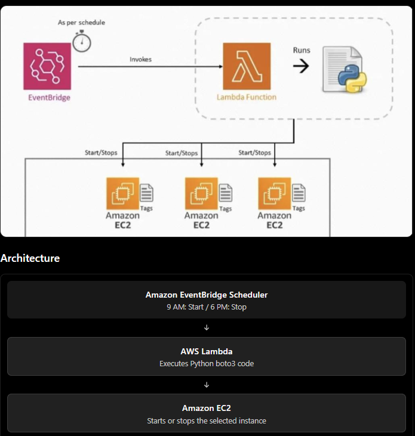

## Objective

Suppose you create an EC2 instance for learning AWS. You use it from 9 AM to 6 PM, but leave it running overnight.
You may be paying for compute capacity when you aren't using it.

The solution is to use Amazon EventBridge Scheduler and AWS Lambda to start and stop EC2 instances automatically.



## Step 1: Launch an EC2 instance

1. Open AWS Console → EC2 → Launch instance.
2. Name it `cost-optimization-demo`.
3. Choose Amazon Linux and a small eligible instance type.
4. Launch the instance and copy its Instance ID.

Example:
```
i-0123456789abcdef0
```

For this project, use a small test instance and set an AWS Budget first.

## Step 2: Create an IAM role for Lambda

Go to IAM → Roles → Create role.

- Trusted entity: AWS service
- Use case: Lambda
- Attach permissions that allow starting and stopping only your demo EC2 instance.

For production, use a custom least-privilege policy rather than granting full EC2 access.

Example IAM policy (replace the region, account ID, and instance ID):
```yaml
{
  "Version": "2012-10-17",
  "Statement": [
    {
      "Effect": "Allow",
      "Action": [
        "ec2:StartInstances",
        "ec2:StopInstances"
      ],
      "Resource": "arn:aws:ec2:ap-south-1:123456789012:instance/i-0123456789abcdef0"
    }
  ]
}
```
Also attach the basic Lambda execution role policy so Lambda can write logs to CloudWatch.

## Step 3: Create the Lambda function

Go to Lambda → Create function → Author from scratch.

- Function name: `ec2-cost-optimizer`
- Runtime: Python
- Execution role: Use the IAM role you created.

Add the following code:
```python
import boto3
import os

ec2 = boto3.client("ec2", region_name="ap-south-1")

INSTANCE_ID = os.environ["INSTANCE_ID"]

def lambda_handler(event, context):
    action = event.get("action")

    if action == "start":
        ec2.start_instances(
            InstanceIds=[INSTANCE_ID]
        )
        return {"message": "EC2 started"}

    elif action == "stop":
        ec2.stop_instances(
            InstanceIds=[INSTANCE_ID]
        )
        return {"message": "EC2 stopped"}

    return {"message": "Invalid action"}
```

Set the Lambda environment variable:

```
INSTANCE_ID = i-0123456789abcdef0
```

Replace the example instance ID and region with your actual values.

## Step 4: Test the Lambda function

Create a test event with:
```python
{
  "action": "stop"
}
```

Click Test. Check EC2 → Instances to verify the instance is stopped.

Then test with:
```python
{
  "action": "start"
}
```

The instance should start again.
# Step 5: Create EventBridge Schedulers (AWS)

Goal: Automatically start EC2 at 9 AM and stop EC2 at 6 PM daily using Lambda.

## 1. Create Start EC2 Scheduler

AWS Console → Amazon EventBridge → Scheduler → Create schedule

1. Click Create schedule.
    
2. Schedule name: `start-ec2-daily`
    
3. Schedule pattern: Choose Recurring schedule → Cron-based schedule.
```bash
Cron expression

`cron(0 9 * * ? *)`

Every day at 9:00 AM
----------------------------------------------
Timezone

`Asia/Kathmandu`
```

4. Flexible time window: OFF.
    
5. Click Next.
    
6. Target: AWS Lambda → Select your EC2 control Lambda function.
    
7. Configure payload:

```
{"action":"start"}
```

8. Configure execution role (allow Scheduler to invoke Lambda).
    
9. Click Create schedule.

## 2. Create Stop EC2 Scheduler

Repeat the same process with these settings:
```bash
Schedule name: `stop-ec2-daily`

Cron expression: cron(0 18 * * ? *)

Timezone: Asia/Kathmandu

Flexible time window: OFF

Target: Same Lambda function

Lambda input:
{"action":"stop"}
```

Click Create schedule.

----
## How much can you save?

For example, assume an EC2 instance costs $0.05 per hour, and you run it 24/7.

|Usage|Monthly compute cost (30 days)|
|---|---|
|24 hours/day|$36|
|9 hours/day|$13.50|
|Potential compute savings|$22.50 (62.5%)|

This is an illustrative calculation, not a current AWS price quote. Actual savings depend on instance type, region, operating system, pricing model, and other charges.

Stopping an instance generally stops its instance compute charges, but EBS volumes, Elastic IPs in certain configurations, snapshots, and other resources may still incur costs.